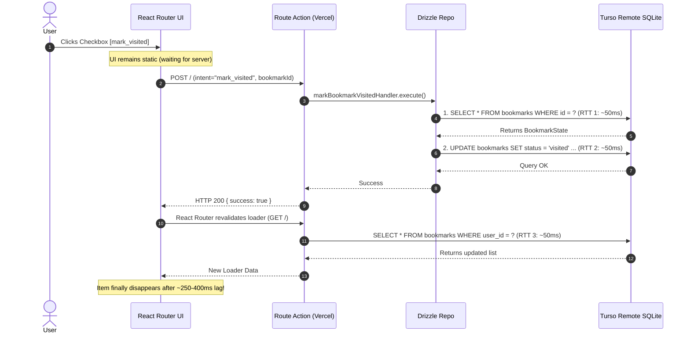
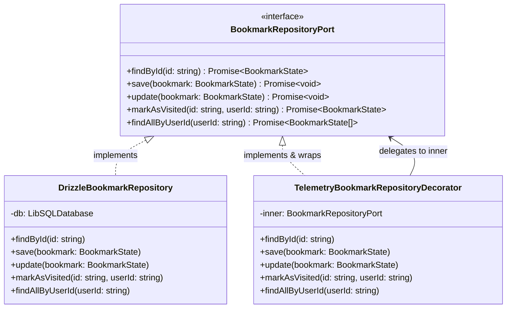

# Design: Latency Telemetry and Optimistic UI (Vercel + Turso)

## Technical Approach

The design achieves instant perceived response times and granular execution observability across Vercel Serverless and Turso Cloud SQLite through three coordinated pillars:

1. **Client-Side Optimistic Derivation via React Router v7 `useFetchers()`**:
   Instead of maintaining fragile local component state or duplicate caches, components inspect all in-flight fetchers via `useFetchers()`. Any active submission with `formData.get("intent") === "mark_visited"` identifies a bookmark ID currently transitioning to `visited`. The UI instantly filters these items from the pending list and recalculates tab badges with zero perceived latency. If an action fails, React Router automatically resets the fetcher, reverting the UI seamlessly.
2. **Single-Trip Atomic SQL Mutation**:
   We replace the sequential `findById` + `update` waterfall in `DrizzleBookmarkRepository` and `MarkBookmarkVisitedCommandHandler` with an atomic `UPDATE bookmarks SET status = 'visited', updated_at = :now WHERE id = :id AND user_id = :userId RETURNING *` query. This cuts remote WAN database latency from Turso in half (from 2 round-trips to 1).
3. **W3C `Server-Timing` Telemetry Utility**:
   A zero-dependency `ServerTiming` helper measures high-resolution durations (`performance.now()`) for authentication, database queries, and handler execution. The resulting metrics are attached to route responses via standard `Server-Timing` HTTP headers, visible directly in browser DevTools and edge logs.

---

## Sequence Comparison

### Current Flow (Passive UI + Sequential Waterfall)



### Optimistic & Atomic Telemetry Flow (0ms Perceived Latency + Single SQL RTT)

```mermaid
sequenceDiagram
    autonumber
    actor User
    participant UI as React Router UI
    participant Action as Route Action (Vercel)
    participant Repo as Drizzle Repo
    participant Turso as Turso Remote SQLite

    User->>UI: Clicks Checkbox [mark_visited]
    rect rgb(235, 255, 235)
        Note over UI: INSTANT (0ms): Item removed from list, counters updated via useFetchers()
    end
    UI->>Action: POST / (intent="mark_visited", bookmarkId)
    Note over Action: ServerTiming starts measurement
    Action->>Repo: markBookmarkVisitedHandler.execute()
    Repo->>Turso: Single SQL: UPDATE bookmarks SET status = 'visited' ... RETURNING * (RTT 1: ~45ms)
    Turso-->>Repo: Returns updated row
    Repo-->>Action: Returns evolved BookmarkState
    Action-->>UI: HTTP 200 { success: true } + Header [Server-Timing: db;dur=45.2, total;dur=48.1]
    UI->>Action: Background revalidation confirms state
    Action-->>UI: Canonical loader data reconciled
    Note over UI: UI remains perfectly smooth with zero flicker!
```

---

## Architecture Decisions

| Area | Decision | Alternatives Considered | Rationale |
|------|----------|-------------------------|-----------|
| **Optimistic State Management** | React Router v7 `useFetchers()` | Local `useState` in parent, Zustand/Redux global store | `useFetchers()` is built into React Router v7, derives state directly from the network action lifecycle, handles race conditions automatically, and requires zero manual cache invalidation or synchronization boilerplate. |
| **Database Status Mutation** | Atomic `UPDATE ... RETURNING *` | Sequential `findById` + `update`, LibSQL interactive batch transaction | LibSQL over HTTP incurs network latency per round-trip. A single SQL statement with `RETURNING *` executes atomically in SQLite in exactly 1 HTTP round-trip without transaction locking overhead. |
| **Telemetry & Observability** | W3C `Server-Timing` HTTP Header | OpenTelemetry Node SDK, Datadog / New Relic APM | OpenTelemetry adds substantial bundle weight and runtime overhead to serverless lambdas. `Server-Timing` is zero-dependency, native to HTTP standards, and renders immediately in the browser Network tab. |
| **Error Rollback Mechanism** | Natural fetcher state termination | Manual undo queues, optimistic snapshot restoration | In React Router v7, when a fetcher completes with an error or fails over the network, its active `formData` is discarded and `fetcher.data` receives the error payload. The derived list automatically falls back to loader data. |

---

## Component & State Design

### 1. In-Flight Visited IDs Extraction

A centralized selector extracts all bookmark IDs currently in transit:

```ts
import { useFetchers } from "react-router";

export function useInFlightVisitedIds(): Set<string> {
  const fetchers = useFetchers();
  const inFlightIds = new Set<string>();

  for (const fetcher of fetchers) {
    if (fetcher.formData?.get("intent") === "mark_visited") {
      const bookmarkId = fetcher.formData.get("bookmarkId")?.toString();
      if (bookmarkId) {
        inFlightIds.add(bookmarkId);
      }
    }
  }

  return inFlightIds;
}
```

### 2. Optimistic Filtering in `PendingChecklistView`

`PendingChecklistView` filters out any bookmark present in `inFlightVisitedIds`:

```tsx
export function PendingChecklistView({
  pendingFolders,
  processingCount = 0,
  expandedCategories,
  onToggleCategory,
}: PendingChecklistViewProps) {
  const inFlightVisitedIds = useInFlightVisitedIds();

  // Optimistically filter bookmarks and prune empty categories/subcategories
  const visibleFolders = pendingFolders
    .map((category) => {
      const visibleSubcategories = category.subcategories
        .map((sub) => ({
          ...sub,
          bookmarks: sub.bookmarks.filter((b) => !inFlightVisitedIds.has(b.id)),
        }))
        .filter((sub) => sub.bookmarks.length > 0);

      return {
        ...category,
        subcategories: visibleSubcategories,
        totalItems: visibleSubcategories.reduce((acc, sub) => acc + sub.bookmarks.length, 0),
      };
    })
    .filter((category) => category.totalItems > 0);

  if (visibleFolders.length === 0 && processingCount === 0) {
    return <EmptyChecklistPlaceholder />;
  }

  // Render visibleFolders...
}
```

### 3. Immediate Tab Counter Calculation

In `dashboard.tsx`, badge counts dynamically reflect in-flight state:

```tsx
const inFlightVisitedCount = inFlightVisitedIds.size;
const optimisticPendingCount = Math.max(0, rawPendingCount - inFlightVisitedCount);
const optimisticVisitedCount = rawVisitedCount + inFlightVisitedCount;
```

---

## Telemetry & Latency Diagnostics Design

### Transparent Repository Decorator Pattern (Hexagonal Architecture)

Rather than manually importing and invoking timing helpers inside individual queries or command handlers, we use the **Decorator Pattern** backed by Node `AsyncLocalStorage`. The telemetry concern is isolated in infrastructure, leaving domain and application layers completely unpolluted.



### 1. `ServerTiming` & `ServerTimingContext` (`AsyncLocalStorage`)

```ts
// src/shared/infrastructure/telemetry/server-timing.ts
import { AsyncLocalStorage } from "node:async_hooks";

export interface TimingEntry {
  name: string;
  duration: number;
  description?: string;
}

export class ServerTiming {
  private metrics = new Map<string, TimingEntry>();
  private startTime = performance.now();

  record(name: string, duration: number, description?: string): void {
    this.metrics.set(name, { name, duration: Number(duration.toFixed(2)), description });
  }

  async measure<T>(name: string, fn: () => Promise<T> | T, description?: string): Promise<T> {
    const start = performance.now();
    try {
      return await fn();
    } finally {
      this.record(name, performance.now() - start, description);
    }
  }

  toHeader(): string {
    const totalDuration = Number((performance.now() - this.startTime).toFixed(2));
    const entries: string[] = [];

    for (const metric of this.metrics.values()) {
      let entry = `${metric.name};dur=${metric.duration}`;
      if (metric.description) {
        entry += `;desc="${metric.description.replace(/"/g, "'")}"`;
      }
      entries.push(entry);
    }

    entries.push(`total;dur=${totalDuration}`);
    return entries.join(", ");
  }
}

export const serverTimingStorage = new AsyncLocalStorage<ServerTiming>();

export async function withServerTiming<T>(
  fn: (timing: ServerTiming) => Promise<T>
): Promise<{ result: T; timing: ServerTiming }> {
  const timing = new ServerTiming();
  const result = await serverTimingStorage.run(timing, () => fn(timing));
  return { result, timing };
}
```

### 2. `TelemetryBookmarkRepositoryDecorator`

```ts
// src/modules/bookmark/infrastructure/telemetry-bookmark-repository-decorator.ts
import { BookmarkRepositoryPort } from "../domain/bookmark-repository-port";
import { BookmarkState } from "../domain/bookmark-schema";
import { serverTimingStorage } from "~/shared/infrastructure/telemetry/server-timing";

export class TelemetryBookmarkRepositoryDecorator implements BookmarkRepositoryPort {
  constructor(private readonly inner: BookmarkRepositoryPort) {}

  private async timed<T>(opName: string, fn: () => Promise<T>): Promise<T> {
    const timing = serverTimingStorage.getStore();
    if (!timing) return fn();
    return timing.measure(`db_${opName}`, fn, `Turso SQL: ${opName}`);
  }

  findById(id: string): Promise<BookmarkState | null> {
    return this.timed("findById", () => this.inner.findById(id));
  }

  save(bookmark: BookmarkState): Promise<void> {
    return this.timed("save", () => this.inner.save(bookmark));
  }

  update(bookmark: BookmarkState): Promise<void> {
    return this.timed("update", () => this.inner.update(bookmark));
  }

  markAsVisited(id: string, userId: string): Promise<BookmarkState> {
    return this.timed("markAsVisited", () => this.inner.markAsVisited(id, userId));
  }

  findAllByUserId(userId: string): Promise<BookmarkState[]> {
    return this.timed("findAllByUserId", () => this.inner.findAllByUserId(userId));
  }
}
```

### 3. Composition Root Wiring (`container.ts`)

```ts
// src/shared/infrastructure/container.ts
import { DrizzleBookmarkRepository } from "~/modules/bookmark/infrastructure/drizzle-bookmark-repository";
import { TelemetryBookmarkRepositoryDecorator } from "~/modules/bookmark/infrastructure/telemetry-bookmark-repository-decorator";

const rawBookmarkRepository = new DrizzleBookmarkRepository();
export const bookmarkRepository = new TelemetryBookmarkRepositoryDecorator(rawBookmarkRepository);
```

### 4. Transparent Loader & Action Usage (`dashboard.tsx`)

Handlers and queries require **ZERO** timing imports. The route simply wraps the execution context:

```ts
export async function loader({ request }: Route.LoaderArgs) {
  const { result, timing } = await withServerTiming(async () => {
    // getFolderTreeQuery seamlessly records its DB time through the decorator
    const folderTree = await getFolderTreeQuery.execute(DEFAULT_USER_ID);
    return { folderTree };
  });

  return data(result, {
    headers: {
      "Server-Timing": timing.toHeader(),
    },
  });
}
```

---

## Atomic SQL Repository Design

### Repository Port Extension

```ts
// src/modules/bookmark/domain/bookmark-repository-port.ts
export interface BookmarkRepositoryPort {
  findById(id: string): Promise<BookmarkState | null>;
  save(bookmark: BookmarkState): Promise<void>;
  update(bookmark: BookmarkState): Promise<void>;
  markAsVisited(id: string, userId: string): Promise<BookmarkState>;
  findAllByUserId(userId: string): Promise<BookmarkState[]>;
}
```

### Drizzle Single-Trip Implementation

```ts
// src/modules/bookmark/infrastructure/drizzle-bookmark-repository.ts
import { and, eq } from "drizzle-orm";

export class DrizzleBookmarkRepository implements BookmarkRepositoryPort {
  // ...
  async markAsVisited(id: string, userId: string): Promise<BookmarkState> {
    const now = new Date();
    const rows = await db
      .update(bookmarksTable)
      .set({
        status: BookmarkStatus.VISITED,
        updatedAt: now,
      })
      .where(and(eq(bookmarksTable.id, id), eq(bookmarksTable.userId, userId)))
      .returning();

    if (rows.length === 0) {
      throw new Error(`Bookmark not found or unauthorized: ${id}`);
    }

    return this.decodeRow(rows[0]);
  }
}
```

### Command Handler Refactoring

```ts
// src/modules/bookmark/application/mark-bookmark-visited-command.ts
export class MarkBookmarkVisitedCommandHandler {
  constructor(
    private repository: BookmarkRepositoryPort,
    private eventBus: EventBusPort
  ) {}

  async execute(rawInput: MarkBookmarkVisitedInput): Promise<void> {
    const input = MarkBookmarkVisitedInputSchema.parse(rawInput);
    
    // Single atomic database round-trip
    const evolved = await this.repository.markAsVisited(input.bookmarkId, input.userId);

    await this.eventBus.publish(
      new BookmarkVisitedEvent({
        bookmarkId: evolved.id,
        userId: evolved.userId,
      })
    );
  }
}
```

---

## File Changes

| File | Action | Description |
|------|--------|-------------|
| `src/shared/infrastructure/telemetry/server-timing.ts` | Create | High-resolution performance timer producing W3C `Server-Timing` headers |
| `src/shared/infrastructure/telemetry/turso-diagnostics.ts` | Create | Diagnostic probe measuring Turso connection latency |
| `src/modules/bookmark/domain/bookmark-repository-port.ts` | Modify | Add `markAsVisited(id: string, userId: string): Promise<BookmarkState>` |
| `src/modules/bookmark/infrastructure/drizzle-bookmark-repository.ts` | Modify | Implement atomic `UPDATE ... RETURNING *` in `markAsVisited` |
| `src/modules/bookmark/application/mark-bookmark-visited-command.ts` | Modify | Use `repository.markAsVisited` for single-query mutation |
| `src/modules/bookmark/ui/pending-checklist-view.tsx` | Modify | Optimistic item filtering using `useFetchers()` |
| `src/modules/bookmark/ui/bookmark-view-tabs.tsx` | Modify | Receive and display derived optimistic tab counts |
| `src/modules/bookmark/ui/visited-history-view.tsx` | Modify | Reflect optimistic visited items if in-flight |
| `src/routes/dashboard.tsx` | Modify | Wrap loader and actions with `ServerTiming`, inject `Server-Timing` headers, pass optimistic counts to tabs |
| `src/shared/infrastructure/telemetry/__tests__/server-timing.test.ts` | Create | Unit tests for `ServerTiming` metric formatting and measurement |
| `src/modules/bookmark/application/__tests__/mark-bookmark-visited-command.test.ts` | Create | Unit tests for atomic mark visited command handler |

---

## Testing Strategy

| Layer | What to Test | Approach |
|-------|-------------|----------|
| **Unit** | `ServerTiming` header formatting and measurement | Vitest unit tests verifying `auth;dur=..., db;dur=...` format and accuracy |
| **Unit** | `MarkBookmarkVisitedCommandHandler` atomic mutation and event dispatch | Vitest unit tests with mocked `BookmarkRepositoryPort` asserting single-call execution |
| **Integration** | `DrizzleBookmarkRepository.markAsVisited` with SQLite | Integration tests with in-memory / file SQLite verifying `RETURNING *` behavior and error on missing ID |
| **Component** | Optimistic Checklist filtering via `useFetchers()` | React component testing verifying immediate hiding of in-flight bookmark IDs |

---

## Migration & Rollout Plan

1. Zero database schema migrations required (the SQLite table schema already supports `status = 'visited'` and `updated_at`).
2. Code updates are 100% backwards compatible.
3. Deploy to Vercel with zero downtime.
