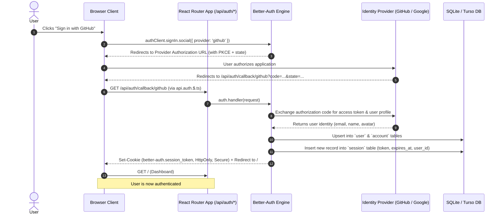
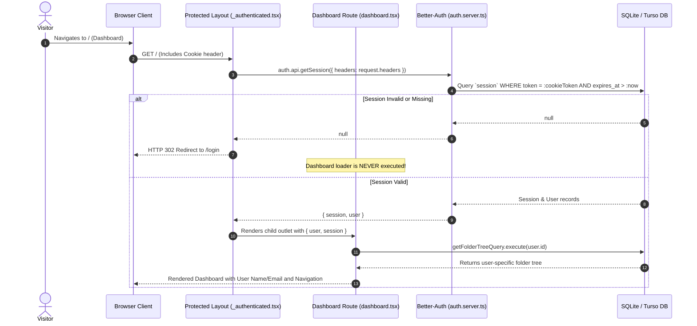
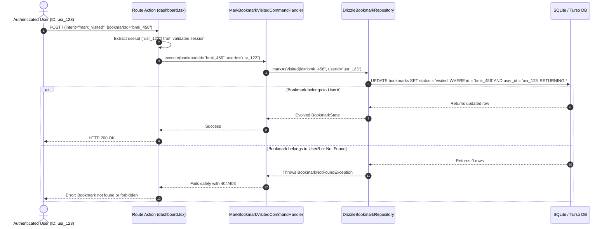

# Design: Multi-User Authentication and Tenant Isolation (Better-Auth + Drizzle)

## Technical Approach

We introduce a modern, multi-tenant authentication and authorization architecture using [Better-Auth](https://www.better-auth.com) backed by Drizzle ORM and LibSQL/SQLite (Turso remote database or local file). 

This design delivers:
1. **First-class OAuth 2.0 / OIDC Identity Providers** (Google & GitHub) with extensible support for Email/Password and Passkeys.
2. **Stateful Database Session Management** in LibSQL/SQLite for instant session revocation and verifiable access.
3. **Protected Layout Boundary** (`src/routes/_authenticated.tsx`) in React Router v7 that acts as an impermeable perimeter around private routes.
4. **Relational Tenant Isolation** with foreign keys, cascading deletes, and composite indexes on `(user_id, status)` in the database layer.
5. **Clean Elimination of Hardcoded Tenant Identifiers** (`DEFAULT_USER_ID = "local-user-1"`), dynamically extracting the active user context across all command and query handlers.

---

## Architectural Diagrams & Sequences

### 1. OAuth Sign-In and Session Creation Flow



### 2. Protected Layout Route Guard Architecture



### 3. Tenant Data Isolation Guard Flow



---

## Database Schema Design (`src/shared/infrastructure/db/schema.ts`)

Better-Auth manages four core relational tables: `user`, `session`, `account`, and `verification`. The existing `bookmarks` table is upgraded with foreign key references and composite indexes.

```typescript
import { sqliteTable, text, integer, index } from "drizzle-orm/sqlite-core";
import { BookmarkStatus } from "~/modules/bookmark/domain/bookmark-status";
import { DefaultTaxonomy } from "~/modules/bookmark/domain/bookmark-category";

// ==========================================
// 1. Better-Auth Core Tables
// ==========================================

export const user = sqliteTable("user", {
  id: text("id").primaryKey(),
  name: text("name").notNull(),
  email: text("email").notNull().unique(),
  emailVerified: integer("email_verified", { mode: "boolean" }).notNull().default(false),
  createdAt: integer("created_at", { mode: "timestamp" }).notNull(),
  updatedAt: integer("updated_at", { mode: "timestamp" }).notNull(),
});

export const session = sqliteTable("session", {
  id: text("id").primaryKey(),
  expiresAt: integer("expires_at", { mode: "timestamp" }).notNull(),
  token: text("token").notNull().unique(),
  createdAt: integer("created_at", { mode: "timestamp" }).notNull(),
  updatedAt: integer("updated_at", { mode: "timestamp" }).notNull(),
  ipAddress: text("ip_address"),
  userAgent: text("user_agent"),
  userId: text("user_id")
    .notNull()
    .references(() => user.id, { onDelete: "cascade" }),
});

export const account = sqliteTable("account", {
  id: text("id").primaryKey(),
  accountId: text("account_id").notNull(),
  providerId: text("provider_id").notNull(),
  userId: text("user_id")
    .notNull()
    .references(() => user.id, { onDelete: "cascade" }),
  accessToken: text("access_token"),
  refreshToken: text("refresh_token"),
  idToken: text("id_token"),
  accessTokenExpiresAt: integer("access_token_expires_at", { mode: "timestamp" }),
  refreshTokenExpiresAt: integer("refresh_token_expires_at", { mode: "timestamp" }),
  scope: text("scope"),
  password: text("password"),
  createdAt: integer("created_at", { mode: "timestamp" }).notNull(),
  updatedAt: integer("updated_at", { mode: "timestamp" }).notNull(),
});

export const verification = sqliteTable("verification", {
  id: text("id").primaryKey(),
  identifier: text("identifier").notNull(),
  value: text("value").notNull(),
  expiresAt: integer("expires_at", { mode: "timestamp" }).notNull(),
  createdAt: integer("created_at", { mode: "timestamp" }),
  updatedAt: integer("updated_at", { mode: "timestamp" }),
});

// ==========================================
// 2. Offload Domain Tables
// ==========================================

export const bookmarksTable = sqliteTable(
  "bookmarks",
  {
    id: text("id").primaryKey(),
    userId: text("user_id")
      .notNull()
      .references(() => user.id, { onDelete: "cascade" }),
    url: text("url").notNull(),
    title: text("title").notNull(),
    description: text("description").notNull().default(""),
    ogImage: text("og_image"),
    category: text("category").notNull().default(DefaultTaxonomy.CATEGORY),
    subcategory: text("subcategory").notNull().default(DefaultTaxonomy.SUBCATEGORY),
    status: text("status", {
      enum: [
        BookmarkStatus.PROCESSING,
        BookmarkStatus.PENDING,
        BookmarkStatus.VISITED,
        BookmarkStatus.FAILED,
      ],
    })
      .notNull()
      .default(BookmarkStatus.PENDING),
    createdAt: integer("created_at", { mode: "timestamp" }).notNull(),
    updatedAt: integer("updated_at", { mode: "timestamp" }).notNull(),
  },
  (table) => [
    index("bookmarks_user_id_idx").on(table.userId),
    index("bookmarks_user_id_status_idx").on(table.userId, table.status),
  ]
);

export type UserSelect = typeof user.$inferSelect;
export type UserInsert = typeof user.$inferInsert;
export type SessionSelect = typeof session.$inferSelect;
export type BookmarkSelect = typeof bookmarksTable.$inferSelect;
export type BookmarkInsert = typeof bookmarksTable.$inferInsert;
```

---

## Server & Client Auth Configurations

### 1. Server Instance (`src/shared/infrastructure/auth/auth.server.ts`)

```typescript
import { betterAuth } from "better-auth";
import { drizzleAdapter } from "better-auth/adapters/drizzle";
import { db } from "~/shared/infrastructure/db/client";
import * as schema from "~/shared/infrastructure/db/schema";

export const auth = betterAuth({
  database: drizzleAdapter(db, {
    provider: "sqlite",
    schema: {
      user: schema.user,
      session: schema.session,
      account: schema.account,
      verification: schema.verification,
    },
  }),
  socialProviders: {
    github: {
      clientId: process.env.GITHUB_CLIENT_ID || "",
      clientSecret: process.env.GITHUB_CLIENT_SECRET || "",
      enabled: !!process.env.GITHUB_CLIENT_ID,
    },
    google: {
      clientId: process.env.GOOGLE_CLIENT_ID || "",
      clientSecret: process.env.GOOGLE_CLIENT_SECRET || "",
      enabled: !!process.env.GOOGLE_CLIENT_ID,
    },
  },
  session: {
    cookieCache: {
      enabled: true,
      maxAge: 5 * 60, // 5 minutes cache
    },
    expiresIn: 60 * 60 * 24 * 30, // 30 days
    updateAge: 60 * 60 * 24, // 1 day update window
  },
  trustedOrigins: [
    process.env.BETTER_AUTH_URL || "http://localhost:5173",
  ],
});

export type Auth = typeof auth;
```

### 2. Client Instance (`src/shared/infrastructure/auth/auth.client.ts`)

```typescript
import { createAuthClient } from "better-auth/react";

export const authClient = createAuthClient({
  baseURL: typeof window !== "undefined" ? window.location.origin : "",
});

export const { signIn, signOut, useSession } = authClient;
```

### 3. All-in-One Catch-All API Handler (`src/routes/api.auth.$.ts`)

```typescript
import type { LoaderFunctionArgs, ActionFunctionArgs } from "react-router";
import { auth } from "~/shared/infrastructure/auth/auth.server";

export async function loader({ request }: LoaderFunctionArgs) {
  return auth.handler(request);
}

export async function action({ request }: ActionFunctionArgs) {
  return auth.handler(request);
}
```

---

## Protected Layout and Routing Configuration

### 1. Route Definition (`src/routes.ts`)

```typescript
import { type RouteConfig, index, layout, route } from "@react-router/dev/routes";

export default [
  route("login", "routes/login.tsx"),
  route("api/auth/*", "routes/api.auth.$.ts"),
  route("favicon.ico", "routes/favicon.ico.ts"),
  layout("routes/_authenticated.tsx", [
    index("routes/dashboard.tsx"),
  ]),
] satisfies RouteConfig;
```

### 2. Protected Layout (`src/routes/_authenticated.tsx`)

```typescript
import { redirect, Outlet, useLoaderData } from "react-router";
import type { LoaderFunctionArgs } from "react-router";
import { auth } from "~/shared/infrastructure/auth/auth.server";
import { authClient } from "~/shared/infrastructure/auth/auth.client";
import { BookmarkIcon, LogOutIcon } from "~/shared/ui/icons";

export async function loader({ request }: LoaderFunctionArgs) {
  const session = await auth.api.getSession({
    headers: request.headers,
  });

  if (!session) {
    return redirect("/login");
  }

  return { user: session.user, session: session.session };
}

export default function AuthenticatedLayout() {
  const { user } = useLoaderData<typeof loader>();

  const handleSignOut = async () => {
    await authClient.signOut({
      fetchOptions: {
        onSuccess: () => {
          window.location.href = "/login";
        },
      },
    });
  };

  return (
    <div className="min-h-screen bg-canvas text-canvas-text flex flex-col">
      <header className="border-b border-border bg-card-bg/60 backdrop-blur px-6 py-3 flex items-center justify-between">
        <div className="flex items-center gap-3">
          <div className="p-2 rounded-lg bg-primary/10 text-primary">
            <BookmarkIcon size={20} />
          </div>
          <span className="font-semibold text-lg tracking-tight">Offload</span>
        </div>

        <div className="flex items-center gap-4">
          <div className="flex items-center gap-2 text-sm text-muted-text">
            <span className="font-medium text-canvas-text">
              {user.name || user.email}
            </span>
          </div>

          <button
            onClick={handleSignOut}
            className="btn-ghost flex items-center gap-1.5 text-xs text-muted-text hover:text-danger p-1.5 rounded"
            title="Sign out"
          >
            <LogOutIcon size={16} />
            <span className="hidden sm:inline">Sign out</span>
          </button>
        </div>
      </header>

      <main className="flex-1">
        <Outlet context={{ user }} />
      </main>
    </div>
  );
}
```

---

## Migration and Backfill Strategy

To seamlessly upgrade existing installations containing `local-user-1` records:

1. **Schema Evolution**:
   Run `drizzle-kit push` or execute SQLite DDL to create `user`, `session`, `account`, `verification` tables.
2. **Backfill Script (`scripts/migrate-local-user.ts`)**:
   - Check if bookmarks with `user_id = 'local-user-1'` exist.
   - If found and no primary user exists, create a default local admin user in the `user` table:
     `{ id: 'local-user-1', name: 'Local Admin', email: 'admin@offload.local', emailVerified: true }`.
   - Alternatively, when the first OAuth user signs in, prompt or automatically link legacy bookmarks with `UPDATE bookmarks SET user_id = :newUserId WHERE user_id = 'local-user-1'`.
3. **Foreign Key Enforcement**:
   Enable `PRAGMA foreign_keys = ON;` in SQLite connections so constraints are strictly respected.

---

## Security Considerations

1. **CSRF Protection**:
   Better-Auth employs cryptographically signed `state` query parameters with PKCE code challenges on all OAuth handshakes, preventing cross-site request forgery and authorization code interception.
2. **Cookie Hardening**:
   Session cookies are issued with `HttpOnly` (inaccessible to JavaScript document.cookie), `SameSite=Lax` (safeguards against cross-origin submission), and `Secure` (in HTTPS environments).
3. **Strict Query Parameterization**:
   All Drizzle ORM operations parameterize inputs, eliminating SQL injection vectors across Turso and SQLite.
4. **Tenant Query Invariants**:
   No repository query may execute `WHERE id = ?` without also asserting `AND user_id = ?`. This is enforced at the repository adapter interface level.
