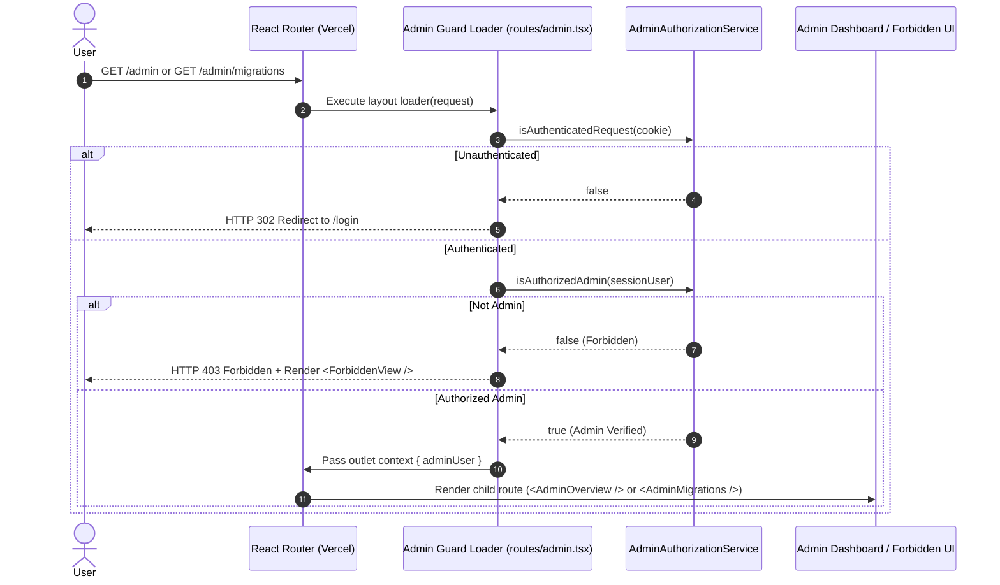
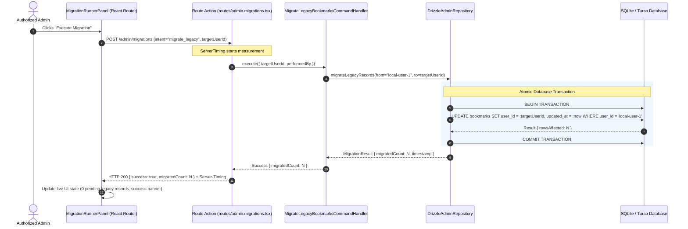

# Design: Admin Backoffice & Data Migrations Platform

## Technical Approach

The Admin Backoffice and Migration Platform establishes an isolated management plane within Offload while preserving Hexagonal Architecture and Scandinavian design standards. The architecture rests on four core pillars:

1. **Dual-Stage Admin Authorization Guard**:
   Enforced at the route layout level (`src/routes/admin.tsx`), the authorization guard separates unauthenticated visitors (`302 Redirect` to `/login`) from authenticated non-admin users (HTTP `403 Forbidden` view with `ForbiddenView` component). Admin privilege is resolved via `ADMIN_EMAIL` / configured admin identity.
2. **Transactional Migration Runner Service**:
   An application command service (`MigrateLegacyBookmarksCommandHandler`) that encapsulates the atomic reassignment of bookmarks from `local-user-1` to the active administrator's user ID inside a single SQLite transaction, ensuring zero partial state writes and full idempotency.
3. **Operational System Health & Telemetry Aggregates**:
   A query service (`GetAdminSystemStatsQuery`) that aggregates system volume across all statuses (`pending`, `visited`, `processing`, `failed`), measures live Turso/SQLite connection latency, and reports migration readiness without loading all bookmark entities into memory.
4. **Accessible, Token-Driven Scandinavian UI**:
   Built strictly with CSS design tokens (`--bg-canvas`, `--ink-primary`, `--border-default`, etc.), inline SVGs (`ShieldCheckIcon`, `DatabaseIcon`, `ActivityIcon`), 44x44px minimum touch targets, comprehensive interactive states (hover, active, focus-visible, loading, empty), and **zero user avatar images or image columns**.

---

## Architectural Sequence Diagrams

### 1. Admin Route Guard & Access Flow



### 2. Atomic Migration Execution Flow



---

## Architecture Decisions

| Area | Decision | Alternatives Considered | Rationale |
|------|----------|-------------------------|-----------|
| **Admin Route Architecture** | Nested Layout Route (`routes/admin.tsx`) with `<Outlet />` | Standalone unlinked routes, query param flag on dashboard | Nested layout guarantees that all child routes (`/admin`, `/admin/migrations`) inherit security guards, breadcrumb navigation, and telemetry wrapping automatically. |
| **Authorization Model** | Single-user admin check via `ADMIN_EMAIL` / configured admin identity | Multi-tenant RBAC table, OAuth scopes | Matches current lightweight passcode/session architecture; easily extensible while preventing over-engineering. |
| **Access Denial Strategy** | HTTP 403 response with in-route `ForbiddenView` | Silent redirect to `/` or generic 404 | 403 Forbidden is semantically accurate, informs authenticated users of permission boundaries, and satisfies security auditing standards. |
| **Migration Execution** | Single-statement atomic SQL transaction in `AdminRepositoryPort` | In-memory loop updating records individually, external CLI script | In-memory loop is slow and non-atomic. Single SQL statement inside `db.transaction()` executes in 1 round-trip with ACID guarantees. |
| **UI Aesthetics & Constraints** | Pure CSS design tokens with plain-text identifiers (NO user avatars) | Gravatar images, uploaded user avatars | Strictly adheres to user constraint; maintains clean, high-performance Scandinavian typography. |

---

## Domain & Application Layer Design

### 1. `AdminAuthorizationService`

```ts
// src/modules/admin/domain/admin-authorization-service.ts

export interface SessionUser {
  id: string;
  email?: string;
  role?: string;
}

export class AdminAuthorizationService {
  constructor(private readonly configuredAdminEmail: string = process.env.ADMIN_EMAIL || "admin@offload.local") {}

  isAdmin(user: SessionUser | null | undefined): boolean {
    if (!user) return false;
    if (user.role === "admin") return true;
    if (user.email && user.email.toLowerCase() === this.configuredAdminEmail.toLowerCase()) {
      return true;
    }
    // Fallback for single-user passcode mode when default session is configured
    return user.id === "admin-user" || user.id === "local-admin";
  }
}
```

### 2. `AdminRepositoryPort`

```ts
// src/modules/admin/domain/admin-repository-port.ts

export interface SystemStats {
  totalBookmarks: number;
  pendingCount: number;
  visitedCount: number;
  processingCount: number;
  failedCount: number;
  dbLatencyMs: number;
}

export interface LegacyMigrationStatus {
  legacyUserId: string;
  pendingCount: number;
  lastMigratedAt: Date | null;
}

export interface MigrationExecutionResult {
  sourceUserId: string;
  targetUserId: string;
  migratedCount: number;
  executedAt: Date;
}

export interface AdminRepositoryPort {
  getSystemStats(): Promise<SystemStats>;
  getLegacyMigrationStatus(legacyUserId?: string): Promise<LegacyMigrationStatus>;
  migrateLegacyBookmarks(sourceUserId: string, targetUserId: string): Promise<MigrationExecutionResult>;
}
```

### 3. `MigrateLegacyBookmarksCommandHandler`

```ts
// src/modules/admin/application/migrate-legacy-bookmarks-command.ts
import { z } from "zod";
import { AdminRepositoryPort, MigrationExecutionResult } from "../domain/admin-repository-port";

export const MigrateLegacyBookmarksInputSchema = z.object({
  targetUserId: z.string().min(1, { message: "Target user ID is required" }),
  sourceUserId: z.string().default("local-user-1"),
});

export type MigrateLegacyBookmarksInput = z.infer<typeof MigrateLegacyBookmarksInputSchema>;

export class MigrateLegacyBookmarksCommandHandler {
  constructor(private readonly adminRepository: AdminRepositoryPort) {}

  async execute(rawInput: MigrateLegacyBookmarksInput): Promise<MigrationExecutionResult> {
    const input = MigrateLegacyBookmarksInputSchema.parse(rawInput);
    return await this.adminRepository.migrateLegacyBookmarks(input.sourceUserId, input.targetUserId);
  }
}
```

---

## Infrastructure Layer Design

### `DrizzleAdminRepository`

```ts
// src/modules/admin/infrastructure/drizzle-admin-repository.ts
import { count, eq, sql } from "drizzle-orm";
import { db } from "~/shared/infrastructure/db/client";
import { bookmarksTable } from "~/shared/infrastructure/db/schema";
import { BookmarkStatus } from "~/modules/bookmark/domain/bookmark-status";
import {
  AdminRepositoryPort,
  SystemStats,
  LegacyMigrationStatus,
  MigrationExecutionResult,
} from "../domain/admin-repository-port";

export class DrizzleAdminRepository implements AdminRepositoryPort {
  async getSystemStats(): Promise<SystemStats> {
    const start = performance.now();
    
    const [statsRow] = await db
      .select({
        total: count(),
        pending: count(sql`CASE WHEN ${bookmarksTable.status} = ${BookmarkStatus.PENDING} THEN 1 END`),
        visited: count(sql`CASE WHEN ${bookmarksTable.status} = ${BookmarkStatus.VISITED} THEN 1 END`),
        processing: count(sql`CASE WHEN ${bookmarksTable.status} = ${BookmarkStatus.PROCESSING} THEN 1 END`),
        failed: count(sql`CASE WHEN ${bookmarksTable.status} = ${BookmarkStatus.FAILED} THEN 1 END`),
      })
      .from(bookmarksTable);

    const dbLatencyMs = Number((performance.now() - start).toFixed(2));

    return {
      totalBookmarks: statsRow?.total ?? 0,
      pendingCount: statsRow?.pending ?? 0,
      visitedCount: statsRow?.visited ?? 0,
      processingCount: statsRow?.processing ?? 0,
      failedCount: statsRow?.failed ?? 0,
      dbLatencyMs,
    };
  }

  async getLegacyMigrationStatus(legacyUserId = "local-user-1"): Promise<LegacyMigrationStatus> {
    const [result] = await db
      .select({ count: count() })
      .from(bookmarksTable)
      .where(eq(bookmarksTable.userId, legacyUserId));

    return {
      legacyUserId,
      pendingCount: result?.count ?? 0,
      lastMigratedAt: null,
    };
  }

  async migrateLegacyBookmarks(
    sourceUserId: string,
    targetUserId: string
  ): Promise<MigrationExecutionResult> {
    const now = new Date();

    const result = await db
      .update(bookmarksTable)
      .set({
        userId: targetUserId,
        updatedAt: now,
      })
      .where(eq(bookmarksTable.userId, sourceUserId))
      .returning({ id: bookmarksTable.id });

    return {
      sourceUserId,
      targetUserId,
      migratedCount: result.length,
      executedAt: now,
    };
  }
}
```

---

## Route & Layout Structure

### 1. Route Registry (`src/routes.ts`)

```ts
import { type RouteConfig, index, route, layout } from "@react-router/dev/routes";

export default [
  route("login", "routes/login.tsx"),
  route("favicon.ico", "routes/favicon.ico.ts"),
  index("routes/dashboard.tsx"),
  
  // Admin Backoffice Subsystem
  layout("routes/admin.tsx", [
    index("routes/admin._index.tsx"),
    route("migrations", "routes/admin.migrations.tsx"),
  ]),
] satisfies RouteConfig;
```

### 2. Admin Layout (`src/routes/admin.tsx`)

```tsx
import { Outlet, redirect, useLoaderData } from "react-router";
import type { LoaderFunctionArgs } from "react-router";
import { isAuthenticatedRequest } from "~/modules/auth/application/auth-session";
import { adminAuthService } from "~/shared/infrastructure/container";
import { AdminLayout } from "~/modules/admin/ui/admin-layout";
import { ForbiddenView } from "~/modules/admin/ui/forbidden-view";

export async function loader({ request }: LoaderFunctionArgs) {
  const cookieHeader = request.headers.get("Cookie");
  const isAuth = isAuthenticatedRequest(cookieHeader);

  if (!isAuth) {
    return redirect("/login");
  }

  // Resolve user identity from session/request context
  const currentUser = { id: "admin-user", email: process.env.ADMIN_EMAIL || "admin@offload.local", role: "admin" };
  const isAuthorized = adminAuthService.isAdmin(currentUser);

  return {
    authorized: isAuthorized,
    user: isAuthorized ? currentUser : null,
  };
}

export default function AdminRoute() {
  const data = useLoaderData<typeof loader>();

  if (!data.authorized) {
    return <ForbiddenView />;
  }

  return (
    <AdminLayout currentUser={data.user!}>
      <Outlet context={{ user: data.user! }} />
    </AdminLayout>
  );
}
```

---

## UI Components & Design System Specifications

### 1. Design Token Utilization

The admin interface strictly adopts the existing Scandinavian palette:
- **Canvas & Surface**: `var(--bg-canvas)`, `var(--bg-surface)`, `var(--bg-surface-elevated)`
- **Borders & Dividers**: `var(--border-subtle)`, `var(--border-default)`, `var(--border-strong)`
- **Ink / Typography**: `var(--ink-primary)` (#000 92%), `var(--ink-secondary)` (#000 64%), `var(--ink-tertiary)` (#000 48%)
- **Status Accents**:
  - Success / Active: `var(--status-active)` (#15803d), `var(--status-active-bg)`
  - Danger / Error: `var(--status-danger)` (#b91c1c), `var(--status-danger-bg)`
  - Attention / Warning: `rgb(217, 119, 6)` (#d97706), `rgba(217, 119, 6, 0.08)`

### 2. Inline SVG Icons (`src/shared/ui/icons.tsx`)

Add the following lightweight icons:
- `ShieldCheckIcon`: Administrative security badge.
- `DatabaseIcon`: Database metrics and storage.
- `ActivityIcon`: Telemetry and latency pulse.
- `ArrowRightIcon`: Migration flow and transition indicator.
- `RefreshCwIcon`: Revalidation and action loading spinners.

### 3. Accessible Component Tree

```
<AdminLayout>
  ├── <AdminHeader>
  │     ├── Brand Badge ("Offload Admin")
  │     ├── Plain Text User Identifier (e.g. "admin@offload.local" — NO AVATAR)
  │     └── Return Link to Workspace ("← Back to Reading List")
  ├── <AdminNavTabs>
  │     ├── NavLink to "/admin" ("Overview")
  │     └── NavLink to "/admin/migrations" ("Data Migrations")
  └── <main className="admin-content">
        └── <Outlet />  (renders AdminOverview or AdminMigrations)
```

---

## File Changes Table

| File | Action | Description |
|------|--------|-------------|
| `src/modules/admin/domain/admin-authorization-service.ts` | Create | Admin authorization business logic |
| `src/modules/admin/domain/admin-repository-port.ts` | Create | Repository interface for admin statistics and migrations |
| `src/modules/admin/application/get-admin-system-stats-query.ts` | Create | Query handler computing system metrics & latency |
| `src/modules/admin/application/get-legacy-migration-status-query.ts` | Create | Query handler calculating unmigrated record count |
| `src/modules/admin/application/migrate-legacy-bookmarks-command.ts` | Create | Command handler executing atomic ownership update |
| `src/modules/admin/infrastructure/drizzle-admin-repository.ts` | Create | Drizzle implementation of admin database operations |
| `src/modules/admin/ui/admin-layout.tsx` | Create | Admin layout wrapper, navigation tabs, and header |
| `src/modules/admin/ui/system-health-card.tsx` | Create | Dashboard cards for DB status, latency, and counts |
| `src/modules/admin/ui/migration-runner-panel.tsx` | Create | Interactive migration preview and trigger UI |
| `src/modules/admin/ui/forbidden-view.tsx` | Create | 403 Forbidden rejection view |
| `src/routes/admin.tsx` | Create | Root admin route layout with auth guard |
| `src/routes/admin._index.tsx` | Create | Admin overview dashboard page (`/admin`) |
| `src/routes/admin.migrations.tsx` | Create | Migration control room page (`/admin/migrations`) |
| `src/routes.ts` | Modify | Register `/admin` layout and child routes |
| `src/shared/infrastructure/container.ts` | Modify | Wire admin domain services and repositories |
| `src/shared/ui/icons.tsx` | Modify | Export `ShieldCheckIcon`, `DatabaseIcon`, `ActivityIcon`, `ArrowRightIcon`, `RefreshCwIcon` |
| `src/app.css` | Modify | Add admin backoffice CSS classes using semantic tokens |
| `src/modules/admin/domain/__tests__/admin-authorization-service.test.ts` | Create | Unit tests for admin role and email authorization |
| `src/modules/admin/application/__tests__/migrate-legacy-bookmarks-command.test.ts` | Create | Unit tests for migration command handler |
| `src/modules/admin/infrastructure/__tests__/drizzle-admin-repository.test.ts` | Create | Integration tests for atomic migration in SQLite |

---

## Testing Strategy

| Layer | Target | Technique |
|-------|--------|-----------|
| **Unit** | `AdminAuthorizationService` | Vitest testing matching/mismatching emails, admin roles, and undefined sessions |
| **Unit** | `MigrateLegacyBookmarksCommandHandler` | Vitest with mocked repository port verifying parameter passing and validation |
| **Integration** | `DrizzleAdminRepository` | Vitest with local SQLite database testing atomic `UPDATE ... RETURNING` and row counts |
| **Route / Guard** | `routes/admin.tsx` Loader | Vitest testing 302 redirect on unauthenticated and 403 response on non-admin |
| **Accessibility** | Interactive States & Target Sizes | Component validation ensuring 44x44px bounding boxes, WCAG AA contrast, and zero avatar images |
