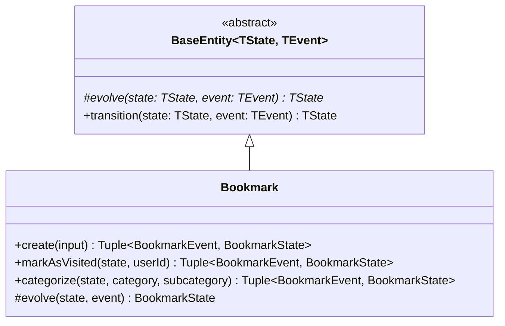
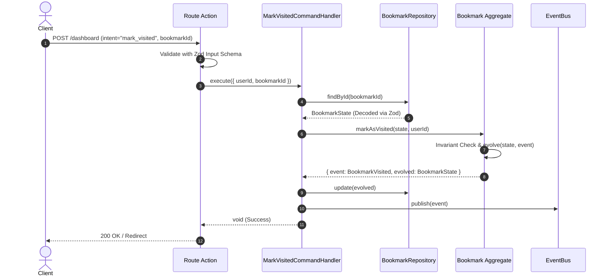
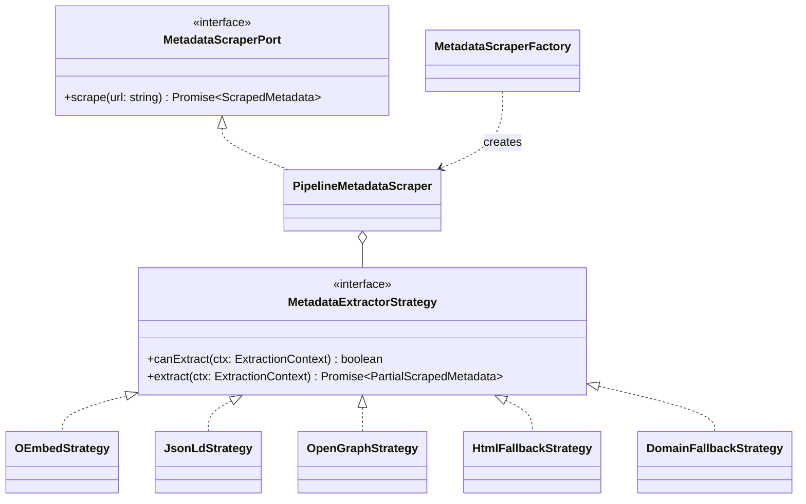
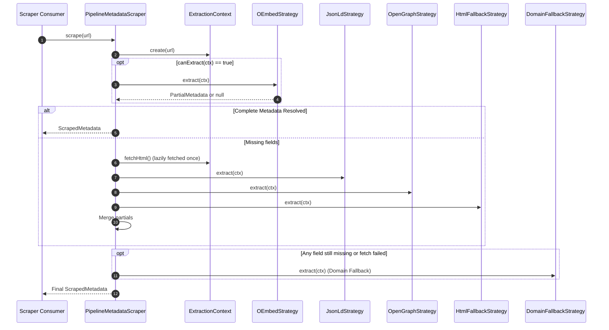

# Design: Domain Modeling Refinements, Zod Boundaries & Scraper Strategy Architecture

## Context & Architectural Rationale

This design refines the application's architecture along three fundamental axes:

1. **Functional Domain-Driven Design (Decider Pattern)**:
   Traditional OOP entities mix state-holding, invariant validation, and mutation. In this architecture:
   - **State** is a pure, immutable data structure validated by Zod.
   - **Aggregate** is a policy unit that enforces invariants and yields a member of an event **Sum Type (Discriminated Union)**.
   - **State Transition** is encapsulated within `BaseEntity`'s `protected evolve()` method that pattern matches on the event sum type.
   - **Command Handlers** orchestrate: fetch state -> call aggregate -> evolve state -> persist evolved state -> publish event.

2. **Strict Boundary Validation (Parse, Don't Validate)**:
   - Repositories decode database rows directly into typed `BookmarkState` using `BookmarkStateSchema.parse(row)`.
   - UI / API routes validate incoming payload with Zod input schemas before invoking application commands.

3. **Pluggable Scraper Architecture (Strategy + Pipeline + Factory)**:
   - Replaces procedural branching with isolated `MetadataExtractorStrategy` implementations.
   - A `PipelineMetadataScraper` composite orchestrates strategies and merges partial metadata.
   - A `MetadataScraperFactory` standardizes scraper instantiation.

---

## 1. Domain Modeling & State Reducer



### Type Definitions & Schemas

```ts
// src/modules/bookmark/domain/bookmark-schema.ts
import { z } from "zod";

export const BookmarkIdSchema = z.string().uuid();
export const UserIdSchema = z.string().min(1);
export const UrlSchema = z.string().url();
export const BookmarkStatusSchema = z.enum(["pending", "visited"]);
export const BookmarkTitleSchema = z.string().min(1).max(500);
export const BookmarkDescriptionSchema = z.string().default("");

export const BookmarkStateSchema = z.object({
  id: BookmarkIdSchema,
  userId: UserIdSchema,
  url: UrlSchema,
  title: BookmarkTitleSchema,
  description: BookmarkDescriptionSchema,
  ogImage: z.string().url().optional(),
  category: z.string().min(1).default("Uncategorized"),
  subcategory: z.string().min(1).default("General"),
  status: BookmarkStatusSchema,
  createdAt: z.date(),
  updatedAt: z.date(),
});

export type BookmarkState = z.infer<typeof BookmarkStateSchema>;
export type BookmarkStatus = z.infer<typeof BookmarkStatusSchema>;
```

### Event Sum Type

```ts
// src/modules/bookmark/domain/bookmark-events.ts
import { BookmarkState } from "./bookmark-schema";

export type BookmarkEvent =
  | { type: "BookmarkCreated"; payload: BookmarkState }
  | { type: "BookmarkCategorized"; payload: { id: string; category: string; subcategory: string; updatedAt: Date } }
  | { type: "BookmarkVisited"; payload: { id: string; userId: string; visitedAt: Date } };
```

### BaseEntity & Bookmark Aggregate

```ts
// src/shared/domain/base-entity.ts
export abstract class BaseEntity<TState, TEvent> {
  protected abstract evolve(state: TState | null, event: TEvent): TState;

  public transition(state: TState | null, event: TEvent): TState {
    return this.evolve(state, event);
  }
}

// src/modules/bookmark/domain/bookmark.ts
export class Bookmark extends BaseEntity<BookmarkState, BookmarkEvent> {
  public create(props: {
    id?: string;
    userId: string;
    url: string;
    title: string;
    description: string;
    ogImage?: string;
    category?: string;
    subcategory?: string;
  }): { event: BookmarkEvent; evolved: BookmarkState } {
    const now = new Date();
    const state = BookmarkStateSchema.parse({
      id: props.id ?? crypto.randomUUID(),
      userId: props.userId,
      url: props.url,
      title: props.title,
      description: props.description,
      ogImage: props.ogImage,
      category: props.category ?? "Uncategorized",
      subcategory: props.subcategory ?? "General",
      status: "pending",
      createdAt: now,
      updatedAt: now,
    });

    const event: BookmarkEvent = { type: "BookmarkCreated", payload: state };
    return { event, evolved: this.evolve(null, event) };
  }

  public markAsVisited(
    state: BookmarkState,
    userId: string
  ): { event: BookmarkEvent; evolved: BookmarkState } {
    if (state.userId !== userId) {
      throw new Error("Unauthorized: Cannot visit bookmark of another user");
    }
    if (state.status === "visited") {
      throw new Error("InvalidInvariant: Bookmark is already marked as visited");
    }

    const event: BookmarkEvent = {
      type: "BookmarkVisited",
      payload: { id: state.id, userId, visitedAt: new Date() },
    };

    return { event, evolved: this.evolve(state, event) };
  }

  public categorize(
    state: BookmarkState,
    category: string,
    subcategory: string
  ): { event: BookmarkEvent; evolved: BookmarkState } {
    if (!category.trim()) throw new Error("Category cannot be empty");

    const event: BookmarkEvent = {
      type: "BookmarkCategorized",
      payload: { id: state.id, category, subcategory, updatedAt: new Date() },
    };

    return { event, evolved: this.evolve(state, event) };
  }

  protected evolve(state: BookmarkState | null, event: BookmarkEvent): BookmarkState {
    switch (event.type) {
      case "BookmarkCreated":
        return event.payload;

      case "BookmarkVisited": {
        if (!state) throw new Error("Cannot evolve null state");
        return {
          ...state,
          status: "visited",
          updatedAt: event.payload.visitedAt,
        };
      }

      case "BookmarkCategorized": {
        if (!state) throw new Error("Cannot evolve null state");
        return {
          ...state,
          category: event.payload.category,
          subcategory: event.payload.subcategory,
          updatedAt: event.payload.updatedAt,
        };
      }
    }
  }
}
```

---

## 2. Command Execution Sequence



---

## 3. Metadata Scraper Architecture



### Extraction Pipeline Flow



---

## 4. Boundary Implementations

### Drizzle Repository Hydration
```ts
// src/modules/bookmark/infrastructure/drizzle-bookmark-repository.ts
export class DrizzleBookmarkRepository implements BookmarkRepositoryPort {
  async findById(id: string): Promise<BookmarkState | null> {
    const rows = await db.select().from(bookmarksTable).where(eq(bookmarksTable.id, id)).limit(1);
    if (rows.length === 0) return null;

    // Decode & validate through Zod schema
    return BookmarkStateSchema.parse({
      ...rows[0],
      ogImage: rows[0].ogImage || undefined,
    });
  }

  async save(bookmark: BookmarkState): Promise<void> {
    const valid = BookmarkStateSchema.parse(bookmark);
    await db.insert(bookmarksTable).values(valid);
  }

  async update(bookmark: BookmarkState): Promise<void> {
    const valid = BookmarkStateSchema.parse(bookmark);
    await db.update(bookmarksTable).set(valid).where(eq(bookmarksTable.id, valid.id));
  }
}
```

---

## 5. Summary of Architecture Benefits

1. **Soundness**: No more guessing if a domain object is valid; Zod guarantees structural validity from the edges into the core.
2. **Deterministic Domain Testing**: The aggregate is 100% testable without database or network mocks; assertions test invariants and state transitions directly.
3. **Open-Closed Scraper**: New extraction sources (e.g. Substack, Twitter/X, GitHub) can be added as standalone strategy classes with their own unit tests without modifying core pipeline logic.
